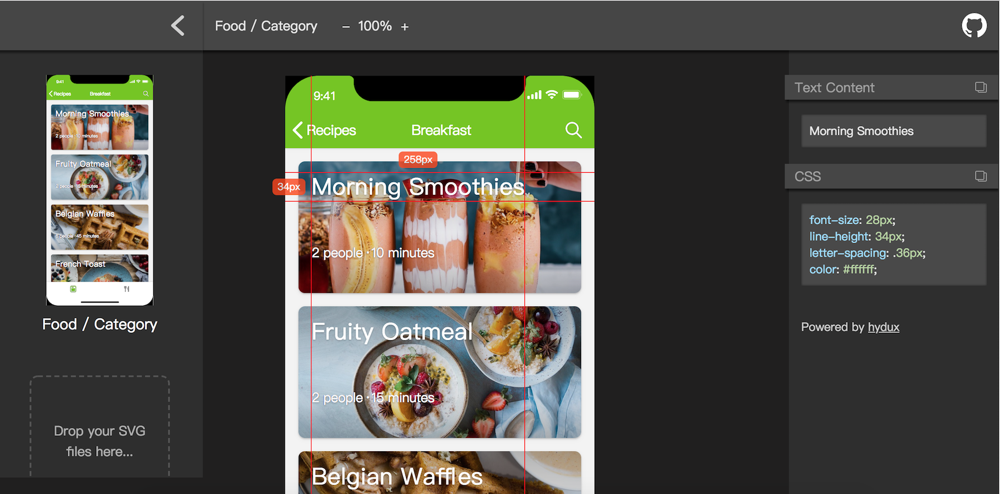

# svg-measure

Measure prototype designs by **SVG** files.

Try  it online: <https://zaaack.github.io/svg-measure>

## Roadmap

* [ ] Scale
* [ ] Context Menu (Copy CSS/Text)
* [ ] Copy SVG/PNG Icons
* [ ] Hide layer
* [ ] Remove Designs
* [ ] Desktop App
* [ ] Online version
